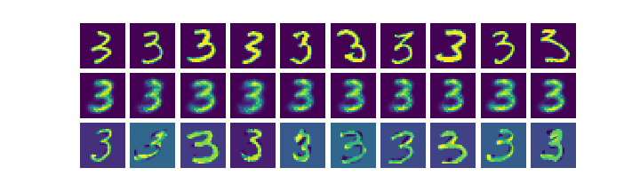

[](https://travis-ci.org/tgsmith61591/smrt)
[](https://codecov.io/gh/tgsmith61591/smrt)


# Constraints-preserving data pipelines 


## Installation

Installation is easy. After cloning the project onto your machine and installing the required dependencies,
simply use the `setup.py` file:

```bash
$ git clone ...
$ cd Synth
$ python setup.py install
```

## About

...

__See [the paper](doc/smrt.tex) for more in-depth reference.__

## Example

The [SMRT example](examples/) is an ipython notebook with reproducible code and data that compares an imbalanced
variant of the MNIST dataset after being balanced with both SMOTE and SMRT. The following are several of the resulting
images produced from both SMOTE and SMRT, respectively. Even visually, it's evident that SMRT better synthesizes data
that resembles the input data.

### Original:

The MNIST dataset was amended to contain only zeros and ones in an unbalanced (~1:100, respectively) ratio. The top row
are the original MNIST images, the second row is the SMRT-generated images, and the bottom row is the SMOTE-generated
images:
<br/>


### Notes

- See [examples](examples/) for usage
- See [the paper](doc/smrt.tex) for more in-depth documentation
- Information on [the authors](AUTHORS.md)
