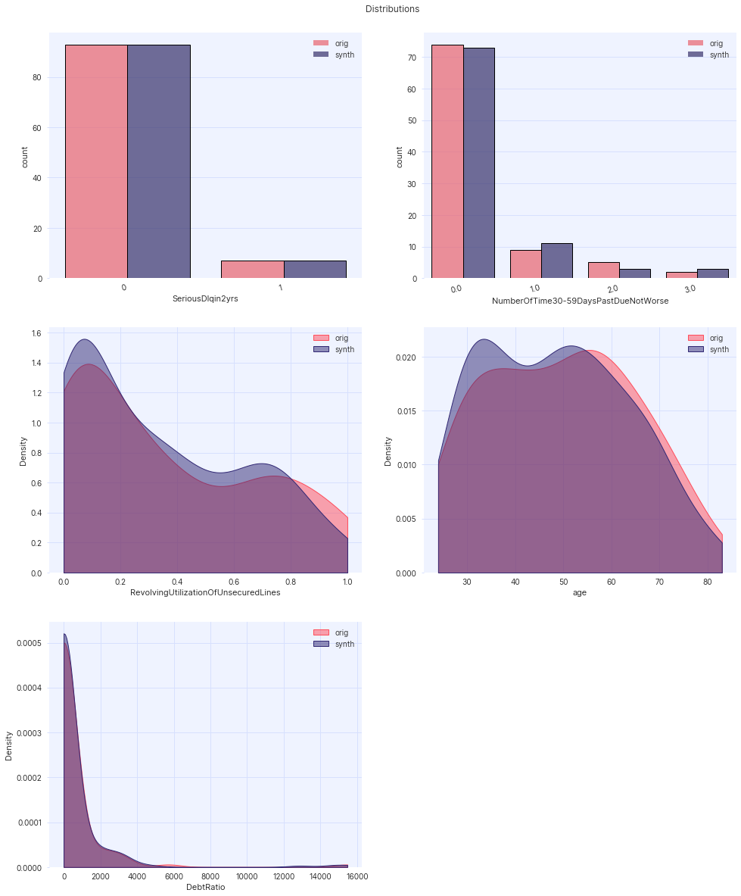
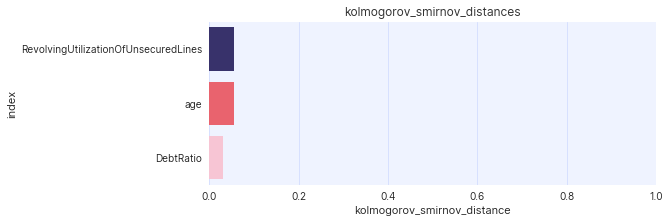
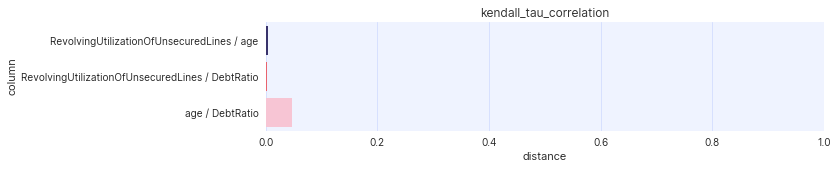

.. _evaluation_guide:

==========
Evaluation
==========

Synthesized includes several methods to assess the quality and utility of generated data. These can be used to answer
two related questions:

- **statistical quality**: does the generated data closely resemble the original data, and maintain the statistical
  properties and correlations?
- **predictive utility**: does the generated data maintain the predictive performance for an ML
  classification/regression task.

Statistical Quality
~~~~~~~~~~~~~~~~~~~

A variety of statistical metrics and techniques can be used to compare the original and synthetic data distributions.
These can be used to assess the synthetic data and its statistical resemblance to the original data. Each of these
metrics are available in ``synthesized.insight.metrics``.

Univariate Metrics
^^^^^^^^^^^^^^^^^^

Marginal distributions in the original and synthesized dataset (of both continuous and categorical attributes) are
compared using univariate statistical distance metrics. For each attribute in the data, these provide a comparison of
the marginal probability distributions of the original and synthetic data. The following metrics are available:

- :class:`~synthesized.insight.metrics.EarthMoversDistance`: calculates the
  `Earth Mover's distance <https://en.wikipedia.org/wiki/Earth_mover%27s_distance>`_ (also known as the 1-Wasserstein
  distance) between two categorical attributes.
- :class:`~synthesized.insight.metrics.KolmogorovSmirnovDistance`: calculates the `Kolmogorov-Smirnov statistic
  <https://en.wikipedia.org/wiki/Kolmogorov%E2%80%93Smirnov_test>`_ between two continuous attributes.

Both of these distances vary between 0.0 and 1.0, where a value of 0.0 occurs when the original and synthetic data have
exactly identical distributions. These metrics can be applied to compare the individual attributes of the synthetic and
original data.

.. ipython:: python
    :verbatim:

    from synthesized.insight.metrics import EarthMoversDistance

    df_synth = synthesizer.synthesize(1000)
    emd = EarthMoversDistance()
    emd(df_original['categorical_column'] df_synth['categorical_column'])

Interaction Metrics
^^^^^^^^^^^^^^^^^^^

Beyond univariate measures that look at single attributes in isolation, correlations and associations between each
column can also be measured and compared between the synthetic and original datasets. Several metrics are used
depending on whether the attributes to compare are categorical or continuous:

- :class:`~synthesized.insight.metrics.KendallTauCorrelation`: calculates the `Kendell-Tau coefficient
  <https://en.wikipedia.org/wiki/Kendall_rank_correlation_coefficient>`_. This measures the correlation
  between two ordinal continuous attributes. (Note: this assumes the two variables have a monotonic relationship.)
- :class:`~synthesized.insight.metrics.CramersV`: calculates the `Cramer's V
  <https://en.wikipedia.org/wiki/Cram%C3%A9r%27s_V>`_ value. This measures the stength of the
  association between two categorical attributes.
- :class:`~synthesized.insight.metrics.CategoricalLogisticR2`: calculates `McFadden's R squared
  <https://thestatsgeek.com/2014/02/08/r-squared-in-logistic-regression/>`_. This measures the association between
  a categorical and continuous attribute.
- :class:`~synthesized.insight.metrics.SpearmanRhoCorrelation`: calculates `Spearman's rank correlation coefficient
  <https://en.wikipedia.org/wiki/Spearman%27s_rank_correlation_coefficient>`_. This measures the association between
  two ordinal continuous attributes.  (Note: this assumes the two variables have a monotonic relationship.)

Each of these metrics can be calculated on the original and synthetic data, and then compared to determine their
statistical similarity.

.. ipython:: python
    :verbatim:

    from synthesized.insight.metrics import CramersV

    df_synth = synthesizer.synthsize(1009)
    cramers = CramersV()

    # calculate association on original data
    cramers(df_original["categorical_column_a"], df_original["categorical_column_b"])

    # calculate association on synthetic data
    cramers(df_original["categorical_column_a"], df_original["categorical_column_b"])

.. note::
    These metrics check the input data to ensure it is categorical or continuous, depending on the assumptions of the
    metric. If the data is of the incorrect type they will return ``None``.

Alternatively, the evaluation metrics can be automatically calculated and visualised for the synthetic and original
data sets using the :class:`synthesized.testing.UtilityTesting` class. 

:class:`synthesized.testing.UtilityTesting` requires a pre-trained :class:`~synthesized.complex.HighDimSynthesizer`, together with dataframes of the original data,
synthetic data, and a hold-out test set of original data.

:class:`synthesized.testing.UtilityTesting` can be used to display distributions of the data as demonstrated below:

.. ipython:: python
    :verbatim:

    import synthesized
    from synthesized.complex import HighDimSynthesizer
    from synthesized.metadata.factory import MetaExtractor
    from synthesized.testing import UtilityTesting
    from synthesized.insight.metrics import KolmogorovSmirnovDistance, KendellTauCorrelation
    
    df = synthesized.util.get_example_data()
    df_meta = MetaExtractor.extract(df)
    synthesizer = HighDimSynthesizer(df_meta)
    synthesizer.learn(num_iterations=500, df_train=df)
    df_synth = synthesizer.synthesize(200)
    testing = UtilityTesting(synthesizer, df, df, df_synth)
    testing.show_distributions()

:class:`synthesized.testing.UtilityTesting` also provides methods to plot univariate and interaction metrics as seen below:

.. ipython:: python
    :verbatim:

    testing.show_first_order_metric_distances(KolmogorovSmirnovDistance())

.. ipython:: python
    :verbatim:

    testing.show_second_order_metric_distances(KendellTauCorrelation())

Predictive Utility
~~~~~~~~~~~~~~~~~~

In addition to comparing statistical metrics, Synthesized can train machine learning algorithms on the synthetic data
and the original data to peform an abitrary classification or regression task. The performance of the models on a
hold-out test set of original data can be compared to determine whether the utility of the synthetic data has been
maintained.

predictive_modelling_score
^^^^^^^^^^^^^^^^^^^^^^^^^^
Synthesized provides an API ``synthesized.insight.metrics.predictive_modelling_score`` which calculates appropriate modelling metrics
for the given dataset using the specified model. The ``model`` parameter can be either one of the following:

- ``"Linear"``: linear regression model
- ``"Logistic"``: logistic regression model
- ``"GradientBoosting"``: gradient boosted decision tree
- ``"RandomForest"``: random forest
- ``"MLP"``: multi-layer percepton (feed-foward neural network)
- ``"LinearSVM"``: support vector machine

or alternatively a custom model class that inherits from the ``BaseEstimator`` together with the ``sklearn.base.ClassifierMixin`` or ``sklearn.base.RegressorMixin`` mixins.

The function will automatically determine whether the prediction task is a classification or regression problem, and
will return either the ROC-AUC or R-squared metric, respectively. All necessary preprocessing (standard scaling, one-hot encoding) is done under the hood.

.. ipython:: python
    :verbatim:

    from synthesized.insight.metrics import predictive_modelling_score

    target = "column_to_predict"
    predictors = ["column_a", "column_b", "column_c"]

    score, metric, task = predictive_modelling_score(df_original, y_label=target, x_labels=predictors, model="GradientBoosting")

predictive_modelling_comparison
^^^^^^^^^^^^^^^^^^^^^^^^^^^^^^^
Synthesized can automatically train models and compare their performance on the original and synthetic data using the API ``synthesized.insight.metrics.predictive_modelling_comparison``
function. It requires the original data, the synthetic data, a target variable to predict, a list of predictor columns, and a model type.

.. ipython:: python
    :verbatim:

    from synthesized.insight.metrics import predictive_modelling_comparison

    target = "column_to_predict"
    predictors = ["column_a", "column_b", "column_c"]
    score, synth_score, metric, task = predictive_modelling_comparison(df_original, df_synth, y_label=target, x_labels=predictors, model="GradientBoosting")