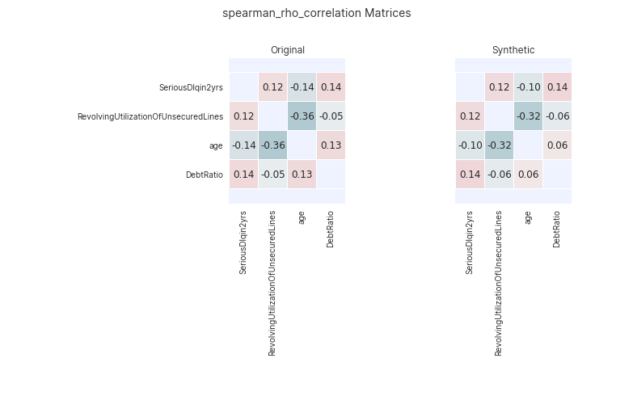

.. _quality_guide:

===================
Statistical Quality
===================

A variety of statistical metrics and techniques can be used to compare the original and synthetic data distributions.
These can be used to assess the synthetic data and its statistical resemblance to the original data. Each of these
metrics are available in ``synthesized.insight.metrics``.

Univariate Metrics
^^^^^^^^^^^^^^^^^^

Marginal distributions in the original and synthesized dataset (of both continuous and categorical attributes) are
compared using univariate statistical distance metrics. For each attribute in the data, these provide a comparison of
the marginal probability distributions of the original and synthetic data. The following metrics are available:

- :class:`~synthesized.insight.metrics.EarthMoversDistance`: calculates the
  `Earth Mover's distance <https://en.wikipedia.org/wiki/Earth_mover%27s_distance>`_ (also known as the 1-Wasserstein
  distance) between two categorical attributes.
- :class:`~synthesized.insight.metrics.KolmogorovSmirnovDistance`: calculates the `Kolmogorov-Smirnov statistic
  <https://en.wikipedia.org/wiki/Kolmogorov%E2%80%93Smirnov_test>`_ between two continuous attributes.

Both of these distances vary between 0.0 and 1.0, where a value of 0.0 occurs when the original and synthetic data have
exactly identical distributions. These metrics can be applied to compare the individual attributes of the synthetic and
original data.

.. ipython:: python
    :verbatim:

    from synthesized.insight.metrics import EarthMoversDistance

    df_synth = synthesizer.synthesize(1000)
    emd = EarthMoversDistance()
    emd(df_original['categorical_column'] df_synth['categorical_column'])

Interaction Metrics
^^^^^^^^^^^^^^^^^^^

Beyond univariate measures that look at single attributes in isolation, correlations and associations between each
column can also be measured and compared between the synthetic and original datasets. Several metrics are used
depending on whether the attributes to compare are categorical or continuous:

- :class:`~synthesized.insight.metrics.KendallTauCorrelation`: calculates the `Kendell-Tau coefficient
  <https://en.wikipedia.org/wiki/Kendall_rank_correlation_coefficient>`_. This measures the correlation
  between two ordinal continuous attributes. (Note: this assumes the two variables have a monotonic relationship.)
- :class:`~synthesized.insight.metrics.CramersV`: calculates the `Cramer's V
  <https://en.wikipedia.org/wiki/Cram%C3%A9r%27s_V>`_ value. This measures the strength of the
  association between two categorical attributes.
- :class:`~synthesized.insight.metrics.CategoricalLogisticR2`: calculates `McFadden's R squared
  <https://thestatsgeek.com/2014/02/08/r-squared-in-logistic-regression/>`_. This measures the association between
  a categorical and continuous attribute.
- :class:`~synthesized.insight.metrics.SpearmanRhoCorrelation`: calculates `Spearman's rank correlation coefficient
  <https://en.wikipedia.org/wiki/Spearman%27s_rank_correlation_coefficient>`_. This measures the association between
  two ordinal continuous attributes.  (Note: this assumes the two variables have a monotonic relationship.)

Each of these metrics can be calculated on the original and synthetic data, and then compared to determine their
statistical similarity.

.. ipython:: python
    :verbatim:

    from synthesized.insight.metrics import CramersV

    df_synth = synthesizer.synthesize(1009)
    cramers = CramersV()

    # calculate association on original data
    cramers(df_original["categorical_column_a"], df_original["categorical_column_b"])

    # calculate association on synthetic data
    cramers(df_original["categorical_column_a"], df_original["categorical_column_b"])

.. note::
    These metrics check the input data to ensure it is categorical or continuous, depending on the assumptions of the
    metric. If the data is of the incorrect type they will return ``None``.

Assessor
^^^^^^^^

Alternatively, the evaluation metrics can be automatically calculated and visualized for the synthetic and original
data sets using the :class:`synthesized.testing.Assessor` class.

:class:`synthesized.testing.Assessor` requires a :class:`synthesized.metadata.DataFrameMeta` class extracted from the
original data-frame, and can be created with these commands:

.. ipython:: python
  :verbatim:

  from synthesized import MetaExtractor
  from synthesized.testing import Assessor

  df_meta = MetaExtractor.extract(df)
  assessor = Assessor(df_meta)

Once the :class:`synthesized.testing.Assessor`, it can be used to compare marginal distributions, joint distributions,
and classification metrics between two data-frames, usually the original and generated data-frames(``df_orig``
and ``df_synth``).

Comparing Marginal Distributions
""""""""""""""""""""""""""""""""

:class:`synthesized.testing.Assessor.show_distributions()` plots all marginal distributions in two datasets,

.. ipython:: python
  :verbatim:

  assessor.show_distributions(df_orig, df_synth)

.. figure:: ../../_static/dist.jpg
  :width: 600px
  :align: center

  Example plot for ``assessor.show_distributions()``.

``assessor.show_ks_distances()`` and ``assessor.show_emd_distances()`` plot for each column the
``KolmogorovSmirnovDistance`` and ``EarthMoversDistance`` difference between both datasets:

.. ipython:: python
  :verbatim:

  assessor.show_ks_distances(df_orig, df_synth)

.. figure:: ../../_static/km_dist.jpg
  :width: 600px
  :align: center

  Example plot of ``assessor.show_ks_distances()``.

The user can also plot the difference of any other univariate metric (let's call it ``MyDistanceMetric``) with the
following command:

.. ipython:: python
  :verbatim:

  assessor.show_first_order_metric_distances(MyDistanceMetric())

Comparing Joint Distributions
"""""""""""""""""""""""""""""

The ``Assessor`` class is also able to plot different joint distributions and correlation distances in two
different manners:

* ``show_second_order_metric_matrices`` (or ``show_second_[metric]_matrices``) plots the matrices of all combinations
  of columns, with the value of the specified metric between each pair columns in the corresponding cell.
* ``show_second_order_metric_distances`` (or ``show_second_[metric]_distances``) plots the distance of the given metric
  for each pair of columns between both datasets.

Both functions are available for the four interaction metrics defined above. For example;

.. ipython:: python
  :verbatim:

  assessor.show_kendall_tau_distances(df_orig, df_synth)
  assessor.show_spearman_rho_matrices(df_orig, df_synth)

.. figure:: ../../_static/kt_dist.png
  :width: 600px
  :align: center

  Example plot of ``assessor.show_kendall_tau_distances()``.

  Example plot of ``assessor.show_spearman_rho_matrices()``.
