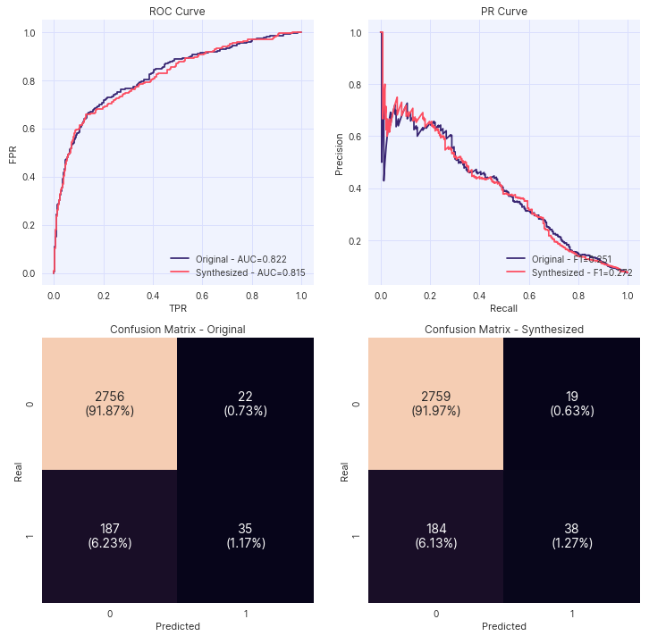

.. _utility_guide:

==================
Predictive Utility
==================

In addition to comparing statistical metrics, Synthesized can train machine learning algorithms on the synthetic data
and the original data to perform an arbitrary classification or regression task. The performance of the models on a
hold-out test set of original data can be compared to determine whether the utility of the synthetic data has been
maintained.

Predictive Modelling Score
^^^^^^^^^^^^^^^^^^^^^^^^^^
Synthesized provides an API ``synthesized.insight.metrics.predictive_modelling_score`` which calculates appropriate
modelling metrics for the given dataset using the specified model. The ``model`` parameter can be either one of the
following:

- ``"Linear"``: linear regression model
- ``"Logistic"``: logistic regression model
- ``"GradientBoosting"``: gradient boosted decision tree
- ``"RandomForest"``: random forest
- ``"MLP"``: multi-layer perceptron (feed-forward neural network)
- ``"LinearSVM"``: support vector machine

or alternatively a custom model class that inherits from the ``BaseEstimator`` together with the
``sklearn.base.ClassifierMixin`` or ``sklearn.base.RegressorMixin`` mixins.

The function will automatically determine whether the prediction task is a classification or regression problem, and
will return either the ROC-AUC or R-squared metric, respectively. All necessary preprocessing (standard scaling, one-hot
encoding...) is done under the hood.

.. ipython:: python
    :verbatim:

    from synthesized.insight.metrics import predictive_modelling_score

    target = "column_to_predict"
    predictors = ["column_a", "column_b", "column_c"]

    score, metric, task = predictive_modelling_score(df_original, y_label=target, x_labels=predictors, model="GradientBoosting")

Predictive Modelling Comparison
^^^^^^^^^^^^^^^^^^^^^^^^^^^^^^^
Synthesized can automatically train models and compare their performance on the original and synthetic data using the API ``synthesized.insight.metrics.predictive_modelling_comparison``
function. It requires the original data, the synthetic data, a target variable to predict, a list of predictor columns, and a model type.

.. ipython:: python
    :verbatim:

    from synthesized.insight.metrics import predictive_modelling_comparison

    target = "column_to_predict"
    predictors = ["column_a", "column_b", "column_c"]
    score, synth_score, metric, task = predictive_modelling_comparison(
        df_original,
        df_synth,
        y_label=target,
        x_labels=predictors,
        model="GradientBoosting"
    )

Assessor
^^^^^^^^

Similar to the :ref:`statistical quality assessment<statistical_quality_guide>`, the ``Assessor`` object can be used
to visualize the performance of a given model. The following functions related to modelling can be called from an
assessor object:

* ``plot_classification_metrics``. Plot the ROC curve, PR curve and Confusion Matrix for the given classifier trained
  on two data-frames, and evaluated on the same dataset.
* ``plot_classification_metrics_test`` Plot the ROC curve, PR curve and Confusion Matrix for the given classifier
  trained on the same data-frame, and evaluated on two different datasets.
* ``utility``. Compute utility, a score of estimator trained on synthetic data and tested on original data.

.. ipython:: python
  :verbatim:

  from synthesized import MetaExtractor
  from synthesized.testing import Assessor

  df_meta = MetaExtractor.extract(df)
  assessor = Assessor(df_meta)

  asr.plot_classification_metrics("TargetColumn", df_test, LogisticRegression())

  Example plot of ``assessor.plot_classification_metrics()``.
