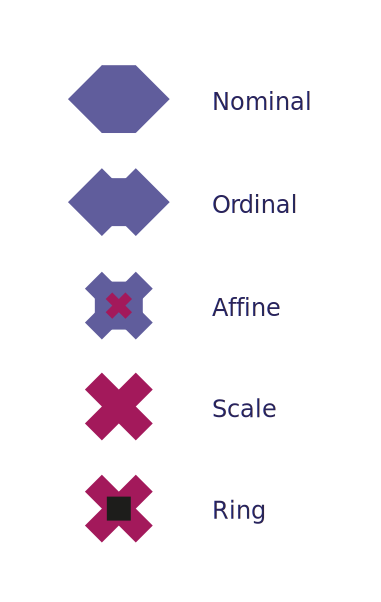

MetaData
========

Metas describe the fundamental properties of data and provide a vertical
hierarchy to the different operations that are possible on some given data.
They wrap around the different DataTypes and can be more informative in terms
of what you can/cannot do to the data.

These Metas therefore enable us to describe the different examples of integer
outlined in the DTypes section.

- Hot Sauce Name    ==>    ``Nominal[String]``
- Category    ==>    ``Nominal[Integer]``
- Cost per bottle    ==>    ``Scale[Integer]``
- Spiciness    ==>    ``Ordinal[Integer]``

.. note::
    "All actual sample spaces are discrete, and all observable random variables
    have discrete distributions. The continuous distribution is a mathematical
    construction, suitable for mathematical treatment, but not practically
    observable."
