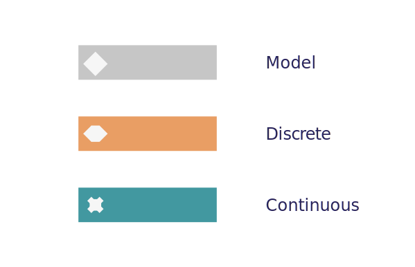

Model
=====

Whilst Metas describe the empirical properties of some data, Models describe an
underlying representation of the process that creates data.

Models are "engine" used to create data. When paired with a Meta, they are able
to understand and learn about some set of data (fit) and then generate data
(sample) from their learned understanding. A fitted model captures all the
information needed to recreate some similar synthetic data.

Discrete and Continous Models can be composed of different Metas. The list
below outlines the different combinations.

- ``Discrete``
    - ``Discrete[Nominal]``
    - ``Discrete[Ordinal]``
    - ``Discrete[Affine]``
    - ``Discrete[Scale]``
    - ``Discrete[Ring]``
- ``Continuous``
    - ``Continuous[Affine]``
    - ``Continuous[Scale]``
    - ``Continuous[Ring]``
