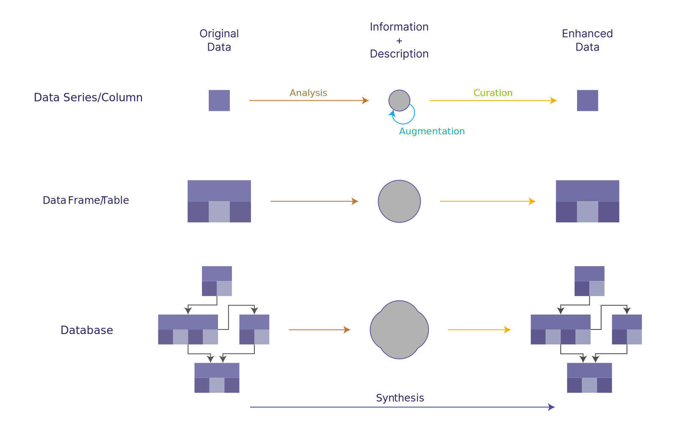

========
Overview
========

Synthesized is the Python SDK of the Synthesized DataOps platform.

The functionality offered by the ML core can be considered as three different
stages of the synthesis process.

1. Analysis - creating a description/understanding from a given dataset.
2. Augmentation - modifying a description with another description.
3. Curation - creating a dataset from a given description/understanding.

We look at achieving these processes on three different levels, which correspond
to different scales of data.

A. DataSeries - A single column of data.
B. DataFrame - A single table or multiple columns of data.
C. DataBase - A single database or multiple data frames/tables of data.

These processes are outlined by the diagram below and are always
concerned with working with data and the information it represents.

Here are just a few of the things that Synthesized does well:

- Generate abritrary amounts of **high quality**, privacy-preserving synthetic datasets.
- **Rebalance** and **reshape** exsiting data through intelligent conditional sampling.
- Improve the quality of original data by **imputing missing values**.

The main use case of the Synthesized SDK is to generate new data products using
synthetic data, that are privacy-preserving by design. By learning an
**intelligent** model of the original data, Synthesized can used to generate
high quality, self-service data that captures as much of the utility of the
original data as possible.

The synthetic data generation is able to incorporate:

- Realistic PII and sensitive data generation, such as names, bank account details and addresses using :ref:`entity annotations<annotation_guide>`.
- Strict business rules and logic using :ref:`rule specification<rules_guide>`.
- Generation of realsitic :ref:`custom formatted strings<formattedstrings_guide>` such as social security numbers.
- Custom scenario generation for testing purposes using :ref:`conditional sampling<conditions_guide>`
